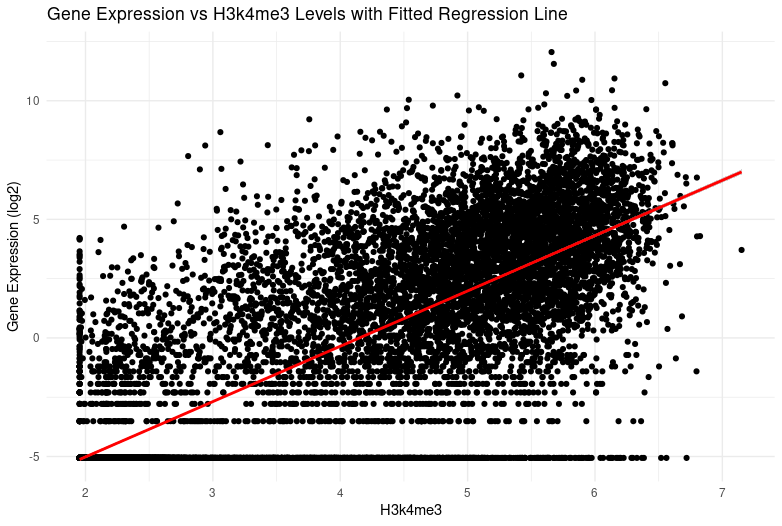
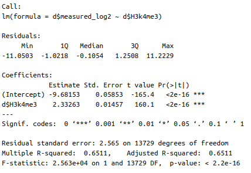
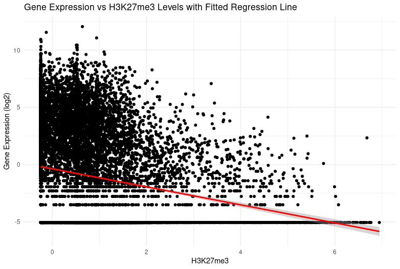
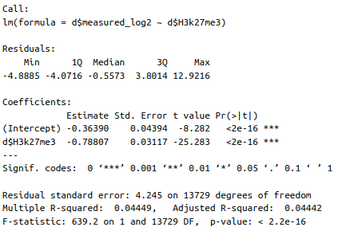
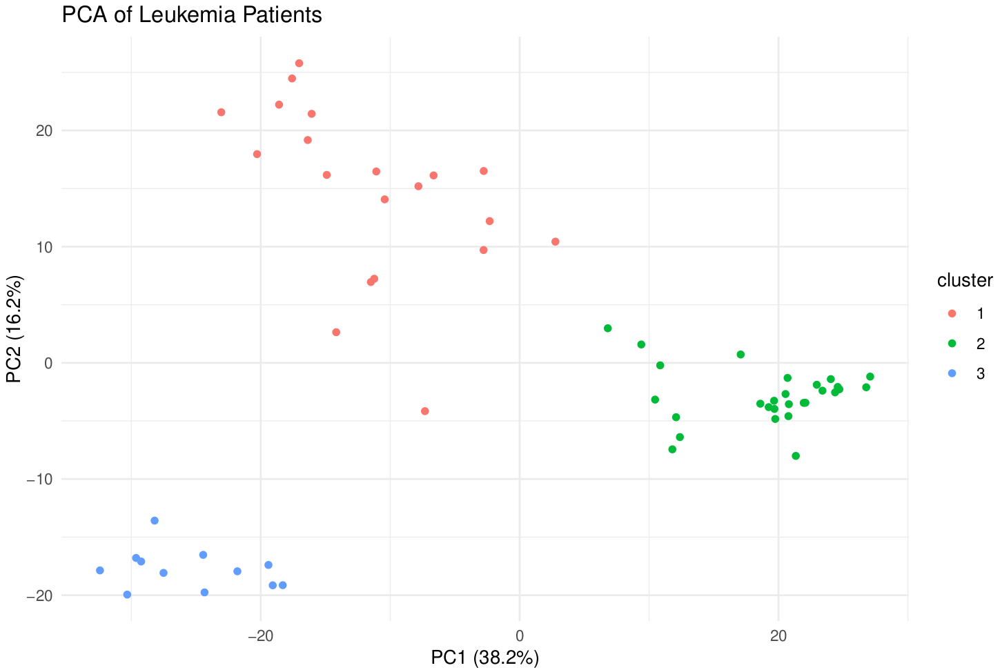

# stats-for-genomics-compgen2025
These tasks were performed during the compgen-2025 module 1: Statistics & Machine Learning for Genomics, taught by Altuna Akalin.

This project contains three analytical tasks focusing on gene expression, clustering, and predictive modeling using regression and machine learning techniques.

Task 1: Gene Expression and Histone Modifications

In this task, a toy dataset was used where rows represent genes, and columns include histone modification scores (H3K4me3, H3K27me3) and gene expression values (measured in log2 scale).

Linear regression models were fitted to examine the relationship between gene expression and histone modifications:

Scatter plots were generated to visualize the regression results and explore correlations between histone modifications and gene expression.

lm(d$measured_log2 ~ d$H3K4me3)

lm(d$measured_log2 ~ d$H3K27me3)

Task 2: K-Means Clustering of Leukemia Patients

In this task, k-means clustering was applied for k-values ranging from 2 to 10. Silhouette scores were computed to determine the optimal number of clusters (k). A PCA plot was generated to visualize patient clustering and assess the separation between clusters.

Task 3: Predicting Age from CpG Methylation Data

This task focuses on building a Random Forest model to predict age based on CpG methylation data. The dataset was randomly split into: 80% training set and 20% test set. A Random Forest regression model was trained to predict age. Model performance was evaluated using R² (R-squared), which measures how well the model explains variance in age.
Model Evaluation:

Sum of Squared Residuals (SSR): Measures prediction error.

Total Sum of Squares (SST): Measures the total variation in actual age values.

R² Score: 0.824, indicating a strong predictive ability (closer to 1 means a better fit).

